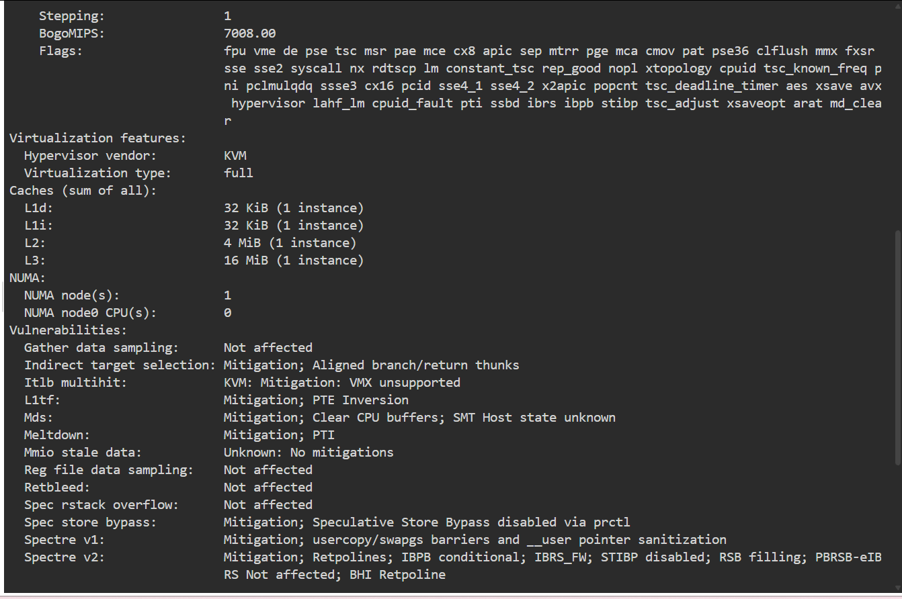

# Laboratory 03 – Multi-Cloud Explorer

## Mission 3: Become a Multi-Cloud Explorer

This laboratory activity explores the major cloud computing platforms: Amazon Web Services (AWS), Microsoft Azure, and Google Cloud Platform (GCP).

The activity focuses on researching cloud services, comparing cloud platforms, analyzing business requirements, and recommending appropriate cloud solutions for different client scenarios.

## Cloud Platforms

- Amazon Web Services (AWS)
- Microsoft Azure
- Google Cloud Platform (GCP)

## Mission Tasks

1. Expand the Cloud Computing Portfolio
2. Explore the Three Cloud Platforms
3. Compare the Major Cloud Platforms
4. Cloud Platform Recommendation Challenge
5. Match the Cloud Services
6. Multi-Cloud Decision Matrix
7. Continue the Linux Investigation
8. Mission Reflection

## Checkpoint 7 – Linux Investigation

The Linux environment used for this investigation was Ubuntu 24.04.4 LTS. The system information was collected using standard Linux commands to identify the operating system, CPU, memory, and available disk space.

### Commands Used

```bash
cat /etc/os-release
lscpu
free -h
df -h
```


### Linux System Information

The Linux environment used for this investigation is Ubuntu 24.04.4 LTS. The following information was collected from the KillerCoda terminal:

- **Operating System:** Ubuntu 24.04.4 LTS
- **CPU:** Intel Xeon E312xx (Sandy Bridge), x86_64
- **Memory:** 1.9 GiB
- **Disk Space:** 19 GB total, with approximately 13 GB available

### Cloud Migration

If this Linux server were migrated to the cloud, it could be hosted using virtual machine services from AWS, Microsoft Azure, and Google Cloud Platform.

- **AWS:** Amazon EC2 can host the Ubuntu Linux server as a virtual machine.
- **Microsoft Azure:** Azure Virtual Machines can host the Ubuntu Linux server.
- **Google Cloud Platform:** Google Compute Engine can host the Ubuntu Linux server.

These services provide virtual machines where a Linux operating system such as Ubuntu can be deployed and managed in the cloud.

### Terminal Evidence

The following screenshots show the Linux commands and system information collected from the KillerCoda terminal.

#### Operating System



#### CPU Information


#### Memory


#### Disk Space


